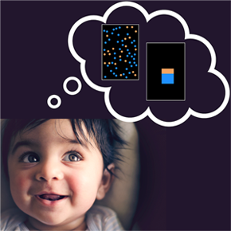

---
---
# Our Active Projects

If you or your child are interested in helping science and taking part in some research, here are a few of our active projects!

 

If you are ready to participate in a study, great! Here is the link to a [Qualtrics form](link). Fill this out and we will add you to our potential participant database and reach out to you if there is a study you are eligible to participate in.

## Do babies pay attention to ratios?

In this study, your baby will sit in a high chair or on your lap and look at pictures of orange and blue shapes. The proportion of shapes that are orange will be different in some pictures. We will measure how long your baby looks at each picture.

**Purpose:** The purpose of this study is to better understand how children reason about numbers. Specifically, this study is about how babies think about ratios like “there are twice as many orange dots as blue dots.” We do this by showing babies pictures of different ratios and measuring how long they pay attention when seeing the same ratio over and over again or a new ratio they haven’t seen yet. For example, “6 orange and 3 blue” is the same ratio as “10 orange and 5 blue” because both are “twice as many orange” but “8 orange and 2 blue” is a new ratio (four times as many orange as blue). We also compare the looking behavior of babies who see color ratios within a single rectangle and babies who see color ratios within a set of dots. Research like this helps us understand babies’ earliest number and math abilities, which helps us learn how math concepts like fractions and counting develop.

**Eligibility:** 6 month old babies

**Compensation:** $5 gift card

### To participate visit [Children Helping Science](https://lookit.mit.edu), create an account and search the study name.

